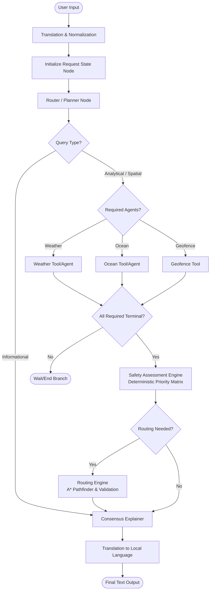
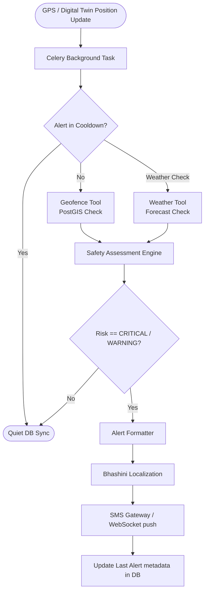

# SagarMitra AI - Production-Grade LangGraph & Safety Engine Plan

This production-grade specification introduces robust state resetting, a strict location resolution policy, structured execution tracking, deterministic safety matrices with an `UNKNOWN` risk tier, action prioritization, and failsafe/cooldown mechanisms for both conversational and background alert flows.

---

## 1. Core Architecture Design

### A. Reactive Flow (Conversational Graph)


### B. Proactive Flow (Background Safety Daemon)


---

## 2. Updated Global State Definition

The `AgentState` contains trackers for execution status, data freshness metrics, UI consensus mappings, and action priorities:

```python
from typing import TypedDict, List, Dict, Any, Optional, Annotated
from langchain_core.messages import BaseMessage
from langgraph.graph.message import add_messages

class AgentState(TypedDict):
    # Core conversation history with the message reducer to prevent duplications
    messages: Annotated[List[BaseMessage], add_messages]
    user_language: Optional[str]               # e.g., "ta" (Tamil), "te" (Telugu)
    
    # Ingested request metadata
    request_type: Optional[str]                # "query" / "gps_update" / "proactive_alert"
    vessel_id: Optional[str]
    vessel_coords: Optional[Dict[str, float]]  # {"lat": 12.34, "lon": 74.56}
    target_coords: Optional[Dict[str, float]]  # Navigation target coordinate
    
    # Intent-Based Routing variables (Compound intents supported)
    query_intents: List[str]                   # ["pfz_search", "border_check", "weather_info"]
    required_agents: List[str]                 # ["weather", "ocean", "geofence"]
    
    # Execution Status Tracker (replaces implicit "is not None" checks)
    # Allowed states: "NOT_REQUIRED", "RUNNING", "SUCCESS", "FAILED"
    agent_status: Dict[str, str]
    
    # Structured Agent Outputs (including provenance metadata)
    weather_report: Optional[Dict[str, Any]]
    ocean_report: Optional[Dict[str, Any]]
    geofence_report: Optional[Dict[str, Any]]
    
    # Consensus & Explanatory State (For the UI Consensus Map)
    agent_assessments: Dict[str, Dict[str, Any]] # Recommendation & confidence from each agent
    evidence_log: List[Dict[str, Any]]          # Structured metrics adhering to strict unit schemas
    conflicts: List[Dict[str, Any]]             # Identified disagreements between agent modules
    decision_trace: List[str]                  # Steps taken by the safety router
    
    # Safety Classification Output
    final_risk_level: Optional[str]            # "SAFE" / "WARNING" / "CRITICAL" / "UNKNOWN"
    override_reasons: List[str]                # Accumulated causes of alerts
    decision_confidence: float                 # Calculated data reliability score (0.0 to 1.0)
    
    # Routing Output
    suggested_route: Optional[List[Dict[str, float]]]
    routing_action: Optional[str]              # "no_routing", "exit_zone", "return_to_safe", "preventative_steer_away", etc.
    
    # Final Output
    consensus_advice: Optional[str]            # The finalized English explanation ready for translation
```

---

## 3. State & Memory Management Policies

### A. Dedicated Reset Node (`initialize_request_state`)
To prevent session memory leakage across continuous conversation loops, a dedicated entrypoint node wipes all transient variables at the start of every turn while preserving the core message history:

```python
def initialize_request_state(state: AgentState) -> Dict[str, Any]:
    return {
        "query_intents": [],
        "required_agents": [],
        "agent_status": {
            "weather": "NOT_REQUIRED",
            "ocean": "NOT_REQUIRED",
            "geofence": "NOT_REQUIRED",
            "routing": "NOT_REQUIRED"
        },
        "weather_report": None,
        "ocean_report": None,
        "geofence_report": None,
        "agent_assessments": {},
        "evidence_log": [],
        "conflicts": [],
        "decision_trace": [],
        "final_risk_level": None,
        "override_reasons": [],
        "decision_confidence": 1.0,
        "suggested_route": None,
        "routing_action": None,
        "consensus_advice": None
    }
```

### B. Location Resolution Policy
When spatial evaluations are required, coordinates are resolved dynamically using a strict three-tier priority fallback schema:
1.  **Tier 1: Explicit Input Coordinates:** Latitude/Longitude parsed from the user's immediate message query.
2.  **Tier 2: Digital Twin Last Known Position:** The last cached position of the registered vessel in the SQLite/PostgreSQL vessel tracking table.
3.  **Tier 3: Rejection:** If neither is resolved, the query intent is downgraded to `"informational"` and the agents are bypassed with a prompt asking the user to provide their GPS location.

---

## 4. Data Reliability, Provenance & Evidentiary Schema

### A. Standardized Evidence Unit Schema
All evidence items added to the `evidence_log` must follow a strict, typed structure to prevent downstream comparison errors:

```python
{
  "source": str,        # "weather" / "geofence" / "ocean"
  "metric": str,        # "swell_height" / "wind_speed" / "distance_to_boundary"
  "value": float,       # Numerical value
  "unit": str,          # Strictly: "meters" / "km/h" / "degrees" (WGS84 EPSG:4326)
  "timestamp": str      # ISO 8601 string of data acquisition
}
```

### B. Data Freshness Policy
Before any cached or historical database report is used in the safety engine, its acquisition age must be evaluated. If `current_time - data_timestamp > max_age_seconds` (e.g., 3 hours / 10,800 seconds), the report's `data_mode` is flagged as `"stale"` and the agent status is marked as `"FAILED"`.

---

## 5. Safety & Routing Logic

### A. The Action Priority Matrix
If multiple risk warnings occur simultaneously (e.g., a boat crosses the IMBL boundary during a storm), the engine evaluates a deterministic priority hierarchy to assign a single `routing_action`:

| Rank | Action Code | Priority | Route Pathfinder Behavior |
| :--- | :--- | :--- | :--- |
| **1** | `exit_zone` | Highest | Routes immediately to exit the restricted polygon. |
| **2** | `return_to_safe` | High | Calculates route to the nearest safe port or shelter zone. |
| **3** | `preventative_steer_away` | Medium | Suggests minor navigation adjustments to avoid border buffer zone. |
| **4** | `preventative_shelter_route`| Medium-Low | Routes to shelter (only if navigation was already active). |
| **5** | `proceed_with_caution` | Low | Returns warning text with no path alterations. |
| **6** | `no_routing` | Lowest | Returns standard advice. |

### B. The `UNKNOWN / DATA_UNAVAILABLE` Risk Tier
If an agent's execution status is `"FAILED"` for a critical intent-specific dependency (e.g., Geofence data is offline when query intent is `"border_check"`), the system **must** override the safety rating to `UNKNOWN` and set confidence to `0.0`, triggering warning notifications.

### C. Route Pathfinder Validation
The A* pathfinder is evaluated deterministically. If the routing graph resolves to a blocked path (no safe grid nodes exist due to storm overlap) or A* cost exceeds threshold parameters:
*   `routing_action` is updated to `"NO_SAFE_ROUTE"`.
*   The fisherman is warned to drop anchor immediately and remain in position until weather clears.

---

## 6. Proactive Alert Deduplication & Cooldown

To prevent the background worker daemon from spamming the fisherman with identical SMS alerts, a cooling system is implemented in the Celery task runner:

```python
def check_alert_cooldown(vessel_id: str, current_risk: str, db_connection) -> bool:
    # 1. Fetch last sent alert metadata
    last_alert = db_connection.execute(
        "SELECT last_alert_time, last_risk_level FROM alerts WHERE vessel_id = ?", 
        (vessel_id,)
    ).fetchone()
    
    if not last_alert:
        return False # No prior alerts, proceed
        
    last_time, last_risk = last_alert
    elapsed_seconds = current_time - last_time
    
    # 2. Risk Escalation Override
    if current_risk == "CRITICAL" and last_risk == "WARNING":
        return False # Risk escalated, bypass cooldown immediately
        
    # 3. Time Cooldown check
    if elapsed_seconds < 600: # 10-minute cooldown
        return True # Cooldown active, suppress alert
        
    return False
```

---

## 7. Scaffold Code Structure

Below is the complete implementation scaffold including initialization, dynamic router edges, dynamic sync joins, and checkpointer memory savers:

```python
from typing import Literal, List, Dict, Any, Annotated
from langgraph.graph import StateGraph, END
from langgraph.graph.message import add_messages
from langchain_core.messages import BaseMessage, AIMessage, HumanMessage
from langchain_core.prompts import ChatPromptTemplate
from langchain_openai import ChatOpenAI

# 1. Initialize State Graph
workflow = StateGraph(AgentState)

# 2. Node Workflows
def initialize_node(state: AgentState):
    # Core fix: Dedicated initialization node to wipe stale analytical states
    return initialize_request_state(state)

def router_node(state: AgentState):
    # Calls LLM planner to extract compound intents and required tools
    # E.g. Input: "PFZ near IMBL coordinates" -> intents: ["pfz_search", "border_check"]
    return {
        "query_intents": ["pfz_search", "border_check"],
        "required_agents": ["ocean", "geofence"],
        # Initialize execution status map for required agents
        "agent_status": {
            "weather": "NOT_REQUIRED",
            "ocean": "RUNNING",
            "geofence": "RUNNING",
            "routing": "NOT_REQUIRED"
        }
    }

def weather_node(state: AgentState):
    if "weather" not in state["required_agents"]:
        return {"agent_status": {**state["agent_status"], "weather": "NOT_REQUIRED"}}
    try:
        # Fetch weather forecast tools
        return {
            "weather_report": {
                "data": {"wind_speed": 12.0, "swell_height": 1.1},
                "source": "Open-Meteo",
                "data_mode": "live",
                "timestamp": "2026-08-28T22:30:00Z",
                "status": "success"
            },
            "agent_status": {**state["agent_status"], "weather": "SUCCESS"}
        }
    except Exception:
        return {
            "agent_status": {**state["agent_status"], "weather": "FAILED"}
        }

def ocean_node(state: AgentState):
    if "ocean" not in state["required_agents"]:
        return {"agent_status": {**state["agent_status"], "ocean": "NOT_REQUIRED"}}
    try:
        return {
            "ocean_report": {
                "data": {"sst_gradient_front": True},
                "source": "INCOIS",
                "data_mode": "live",
                "timestamp": "2026-08-28T22:30:00Z",
                "status": "success"
            },
            "agent_status": {**state["agent_status"], "ocean": "SUCCESS"}
        }
    except Exception:
        return {
            "agent_status": {**state["agent_status"], "ocean": "FAILED"}
        }

def geofence_node(state: AgentState):
    if "geofence" not in state["required_agents"]:
        return {"agent_status": {**state["agent_status"], "geofence": "NOT_REQUIRED"}}
    try:
        # Query PostGIS
        return {
            "geofence_report": {
                "data": {
                    "in_restricted_zone": False,
                    "nearest_boundary": "IMBL",
                    "distance_to_boundary_meters": 1200.0
                },
                "source": "PostGIS",
                "data_mode": "live",
                "timestamp": "2026-08-28T22:30:00Z",
                "status": "success"
            },
            "agent_status": {**state["agent_status"], "geofence": "SUCCESS"}
        }
    except Exception:
        return {
            "agent_status": {**state["agent_status"], "geofence": "FAILED"}
        }

def safety_rules_node(state: AgentState):
    # Runs the deterministic Safety Engine
    results = evaluate_safety_rules(state)
    return {
        **results,
        "agent_status": {**state["agent_status"], "routing": "RUNNING" if results["routing_action"] != "no_routing" else "NOT_REQUIRED"}
    }

def routing_node(state: AgentState):
    # Call A* Router Pathfinder
    try:
        # Check path viability
        path_viable = True 
        if not path_viable:
            return {
                "routing_action": "NO_SAFE_ROUTE",
                "agent_status": {**state["agent_status"], "routing": "SUCCESS"}
            }
        
        route = [{"lat": 12.3, "lon": 74.5}]
        return {
            "suggested_route": route,
            "agent_status": {**state["agent_status"], "routing": "SUCCESS"}
        }
    except Exception:
        return {
            "agent_status": {**state["agent_status"], "routing": "FAILED"}
        }

def consensus_explainer_node(state: AgentState):
    final_risk = state.get("final_risk_level", "SAFE")
    overrides = "; ".join(state.get("override_reasons", [])) or "None"
    evidence = state.get("evidence_log", [])
    action = state.get("routing_action", "no_routing")
    confidence = state.get("decision_confidence", 1.0)
    
    # Compile provenance data modes
    modes = []
    for report_name in ["weather_report", "ocean_report", "geofence_report"]:
        report = state.get(report_name)
        if report:
            modes.append(f"{report_name.split('_')[0]}: {report.get('data_mode', 'unknown')}")
    data_mode_summary = ", ".join(modes) if modes else "No external reports fetched."

    # Direct response informational check
    if not state.get("query_intents") or "informational" in state.get("query_intents", []):
        prompt_template = ChatPromptTemplate.from_template(
            "You are SagarMitra AI. Answer the following general user inquiry directly and helpfully:\n"
            "Query: {query}"
        )
        user_query = state["messages"][-1].content
        chain = prompt_template | ChatOpenAI(temperature=0.2)
        response = chain.invoke({"query": user_query})
    else:
        # Narrative Consensus Explanation
        prompt_template = ChatPromptTemplate.from_template(
            "You are the Consensus Explainer for SagarMitra AI. "
            "Explain the safety decision to the fisherman clearly and concisely.\n\n"
            "SYSTEM DECISION:\n"
            "- Final Risk Level: {final_risk_level}\n"
            "- Primary Reason(s): {override_reasons}\n"
            "- Evidence Log: {evidence_log}\n"
            "- Conflicts Resolved: {conflicts}\n"
            "- Routing Action: {routing_action}\n"
            "- Confidence Score: {confidence}\n"
            "- Data Mode: {data_mode_summary}\n\n"
            "Explain the safety advice. If confidence is 0.0 or risk is UNKNOWN, explain that data is offline."
        )
        chain = prompt_template | ChatOpenAI(temperature=0.0)
        response = chain.invoke({
            "final_risk_level": final_risk,
            "override_reasons": overrides,
            "evidence_log": evidence,
            "conflicts": state.get("conflicts", []),
            "routing_action": action,
            "confidence": confidence,
            "data_mode_summary": data_mode_summary
        })
        
    advice = response.content
    return {
        "consensus_advice": advice,
        "messages": [AIMessage(content=advice)]
    }

# 3. Define Graph Routing
workflow.add_node("initialize", initialize_node)
workflow.add_node("router", router_node)
workflow.add_node("weather", weather_node)
workflow.add_node("ocean", ocean_node)
workflow.add_node("geofence", geofence_node)
workflow.add_node("safety_rules", safety_rules_node)
workflow.add_node("routing", routing_node)
workflow.add_node("consensus", consensus_explainer_node)

# Set Entrypoint
workflow.set_entry_point("initialize")
workflow.add_edge("initialize", "router")

# Router conditional fan-out
def route_from_router(state: AgentState) -> List[str]:
    # Direct response path bypass
    if "informational" in state.get("query_intents", []):
        return ["consensus"]
        
    next_nodes = []
    reqs = state.get("required_agents", [])
    if "weather" in reqs:
        next_nodes.append("weather")
    if "ocean" in reqs:
        next_nodes.append("ocean")
    if "geofence" in reqs:
        next_nodes.append("geofence")
        
    if not next_nodes:
        return ["safety_rules"]
    return next_nodes

workflow.add_conditional_edges(
    "router",
    route_from_router,
    {
        "weather": "weather",
        "ocean": "ocean",
        "geofence": "geofence",
        "consensus": "consensus",
        "safety_rules": "safety_rules"
    }
)

# Core fix: Enforce fan-in completion rule checking agent_status terminal states
def safety_sync_condition(state: AgentState) -> Literal["safety_rules", "wait"]:
    reqs = state.get("required_agents", [])
    status = state.get("agent_status", {})
    
    # Check if all required agents have reached a terminal status (SUCCESS / FAILED)
    completed = 0
    for agent in reqs:
        if status.get(agent) in ["SUCCESS", "FAILED"]:
            completed += 1
            
    if completed == len(reqs):
        return "safety_rules"
    return "wait"

# Register parallel node conditional exit edges
workflow.add_conditional_edges("weather", safety_sync_condition, {"safety_rules": "safety_rules", "wait": END})
workflow.add_conditional_edges("ocean", safety_sync_condition, {"safety_rules": "safety_rules", "wait": END})
workflow.add_conditional_edges("geofence", safety_sync_condition, {"safety_rules": "safety_rules", "wait": END})

# Conditional edge based on routing action
def routing_router_condition(state: AgentState) -> Literal["routing", "consensus"]:
    if state.get("routing_action") in [
        "exit_zone", "return_to_safe", "calculate_route", 
        "preventative_steer_away", "preventative_shelter_route"
    ]:
        return "routing"
    return "consensus"

workflow.add_conditional_edges(
    "safety_rules",
    routing_router_condition,
    {
        "routing": "routing",
        "consensus": "consensus"
    }
)

workflow.add_edge("routing", "consensus")
workflow.add_edge("consensus", END)

# Compile Graph with persistent MemorySaver
from langgraph.checkpoint.memory import MemorySaver
memory = MemorySaver()
app = workflow.compile(checkpointer=memory)
```
