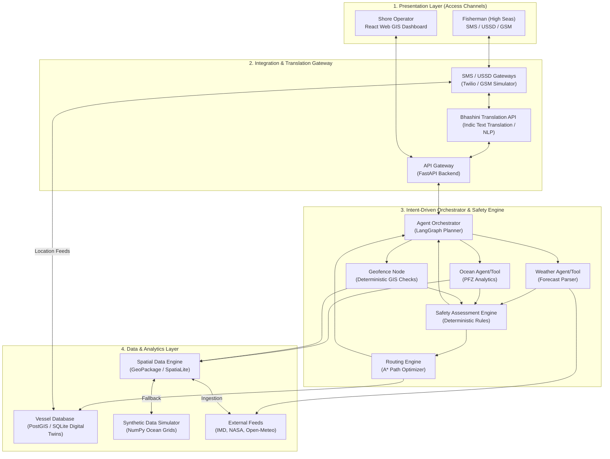

# SagarMitra AI: Multi-Agent Marine Intelligence Platform

SagarMitra AI is an intelligent, multi-agent conversational decision-support system designed to empower fishermen, coastal authorities, researchers, and maritime operators. By integrating satellite Earth Observation (SST, Chlorophyll-a), real-time meteorological forecasts, ocean state advisories, and geofencing layers, it translates complex geospatial data into actionable, regional-language text-based recommendations.

---

## Standout Novelty

To differentiate SagarMitra AI from generic chatbot interfaces (like ChatGPT), we propose three core novelties tailored to the marine and Indian coastal ecosystem:

### 1. Hybrid Low-Bandwidth/Offline Delivery Protocol (Bhashini-Text & USSD/SMS)
*   **The Problem:** Fishermen on the high seas lose internet connectivity (mobile data) beyond 10-15 km from the coast, making modern web-based LLMs useless.
*   **Our Solution:** A low-bandwidth gateway that compiles multi-agent outputs (PFZ coordinates, weather safety) into highly compressed SMS summaries or USSD interactive menus. Using the government-backed **Bhashini API**, queries can be typed in local regional languages (e.g., Tamil, Telugu, Odia, Gujarati, Malayalam, Marathi) and translated instantly, allowing fishermen to query and receive regional text advisories, bypassing internet requirements entirely.

### 2. Proactive Vessel "Digital Twin" & Safety Daemon
*   **The Problem:** Standard search engines are reactive (only answer when queried). If a storm arises or a vessel drifts close to the International Maritime Boundary Line (IMBL), the fisherman may not know until it is too late.
*   **Our Solution:** A lightweight "Digital Twin" registration system for every fishing vessel. A background safety daemon continuously checks the vessel's last known GPS coordinate and planned route against real-time cyclone/lightning vectors, wave heights, and geofenced zones. It automatically triggers emergency text alerts (SMS) if danger is imminent.

### 3. Explainable Multi-Agent Consensus Visualization
*   **The Problem:** LLMs often hallucinate or give black-box advice, which is risky for maritime safety.
*   **Our Solution:** The UI exposes a "Consensus Map" showing how the deterministic **Safety Assessment Engine** evaluates and resolves conflicts:
    *   *Weather Agent/Tool:* Gathers wind speeds, wave swells, and cyclone alerts.
    *   *Ocean Agent/Tool:* Identifies favorable fishing boundaries.
    *   *Geofence Node:* Runs polygon calculations for maritime boundaries.
    The **Safety Assessment Engine** (a deterministic Python rules engine) parses these metrics against strict thresholds. If the Ocean Agent identifies favorable fishing conditions, but the Weather Agent reports severe wind speeds (>45km/h), the Safety Engine automatically triggers a `CRITICAL` safety override. The LLM Consensus Explainer then structures this decision as a clear regional language advisory: *"Unsafe (Wind speed exceeds 45km/h, outweighing calm currents)"* with full evidence log.

---

## Dataset Identification & Strategy

Since real-time ISRO/INCOIS APIs sometimes require authorization or have usage limits, we will implement a dual-layer strategy: **Real Data Integration** supplemented by a **High-Fidelity Synthetic Marine Data Generator**.

| Dataset / Parameter | Real Source | Synthetic Fallback / Simulation Strategy |
| :--- | :--- | :--- |
| **Sea Surface Temp (SST)** | ISRO VEDAS, NASA GHRSST, INCOIS | Gaussian Process Regression modeling thermal plumes and coastal upwelling based on latitude and day of year. |
| **Chlorophyll-a** | ISRO Oceansat-2/3 OCM, Copernicus Sentinel-3 | Perlin noise fields correlated with SST (inverse relationship) and river discharge outlets. |
| **Weather & Wind** | IMD (India Meteorological Dept) API, Open-Meteo Marine | Vector field generation modeling monsoon wind patterns and randomized storm cell triggers. |
| **Wave Heights & Currents** | INCOIS Ocean State Forecast, NOAA Wavewatch III | Wave height simulations based on Beaufort wind scale vectors and bathymetry data. |
| **Geofencing & Boundaries** | GeoJSON files for IMBL (India-Sri Lanka, India-Pakistan), MPAs (Marine Protected Areas) | Standard GIS geometry layers mapped using Shapely (Python) to check point-in-polygon status. |
| **Tides** | Survey of India, INCOIS | Harmonic tidal equation simulator based on lunar phases and coastal stations. |

---

## Division of Tasks (6-Member Team)

We have structured the team into two distinct divisions: **Data Integration Specialists** (responsible for sourcing, cleaning, translating, and simulating the required datasets) and **Feature Logic Developers** (responsible for building the core AI orchestration, spatial routing, safety algorithms, and database systems).

---

### Division A: Data Integration Specialists (Sourcing, Simulating & Localizing Datasets)

#### 1. Sanskar (Oceanographic & Ecological Datasets)
*   **Role:** Ocean Data Engineer & Simulation Architect.
*   **Dataset Sourcing & Curation:**
    *   **Satellite Imagery / Ocean Data:** Identify and write scripts to download historical/current Sea Surface Temperature (SST) and Chlorophyll-a data in NetCDF/HDF5 format from sources like NASA's OceanColor Web, Copernicus Marine Service (CMEMS), and INCOIS.
    *   **Historical Fisheries Records:** Retrieve historical marine landing data (fish catches by state/species) from the Central Marine Fisheries Research Institute (CMFRI) archives to support the decline analysis.
    *   **Tide Tables:** Locate astronomical tide tables or harmonic constituent databases for Indian coastal ports (e.g., Kochi, Mumbai, Chennai, Visakhapatnam).
*   **High-Fidelity Synthetic Data Generator:**
    *   Develop a Python generator using NumPy and SciPy to produce synthetic ocean grids (NetCDF/JSON format) for the Arabian Sea and Bay of Bengal.
    *   Simulate SST gradients (thermal fronts) and Chlorophyll levels (using upwelling simulations correlated with wind/temperature) to ensure the PFZ algorithm can be tested offline.

#### 2. Ishita (Geospatial GIS Layers & Spatial Database Curation)
*   **Role:** GIS Data Acquisition & Spatial Curation Specialist.
*   **Dataset Sourcing, Formatting & Cleaning:**
    *   **Boundary Layers Collection:** Gather, clean, and standardize the GeoJSON/Shapefiles of the International Maritime Boundary Line (IMBL) for India-Sri Lanka, India-Pakistan, and India-Bangladesh.
    *   **Restricted Zones & Geofences:** Compile spatial boundaries of Marine Protected Areas (MPAs), conservation zones, and restricted naval waters.
    *   **Raster Dataset Sourcing:** Download historical and live satellite SST and Chlorophyll-a rasters (in GeoTIFF/NetCDF formats) from ISRO Bhuvan/VEDAS and Copernicus portals.
    *   **Spatial Database & GIS Server:** Reproject all spatial layers to a unified coordinate reference system (WGS84 - EPSG:4326). Store and serve these vector files and raster directories via a localized spatial database (SpatiaLite/GeoPackage) or folders indexed with meta-catalogs, exposing clean file-read APIs to the backend routing and geofencing modules.

#### 3. Arin (Linguistic Text Translations & SMS/USSD Datasets)
*   **Role:** Text translation & SMS/USSD Telemetry Specialist.
*   **Dataset Sourcing & Curation:**
    *   **Linguistic Corpus & API Access:** Secure endpoints/credentials and curate text validation datasets for translation pipelines (Bhashini Text Translation API or AI4Bharat's IndicTrans2 models).
    *   **Regional Terminology Glossary:** Collect a glossary of fishing and marine terms in regional Indian languages (Tamil, Telugu, Malayalam, Gujarati, etc.) to evaluate translation accuracy.
    *   **Low-Bandwidth Encoding Protocols:** Research GSM 03.38 standard alphabets and SMS character mapping data.
*   **USSD and SMS Simulation Integration:**
    *   Develop a dictionary system mapping regional names for marine features (e.g., local names for specific fish types, wind patterns).
    *   Write the low-bandwidth compressor that serializes coordinate strings, safety indices, and alerts into tiny binary strings (under 140 bytes) for SMS delivery.

---

### Division B: Feature Logic Developers (Algorithms, AI & Database Engine)

#### 4. User (AI Agent Orchestrator & API Coordinator)
*   **Role:** Lead Architect & Orchestration developer.
*   **Feature Development:**
    *   **LLM Multi-Agent Network:** Create the core agent framework (e.g., LangGraph or CrewAI) defining agent roles (Weather, Ocean, Safety, Routing) and their prompt templates.
    *   **State Machine Coordinator:** Code the core planning logic which parses queries, maintains conversational memory (contextual history), and delegates sub-tasks to the correct agents.
    *   **FastAPI Backend Gateway:** Build the main application server, exposing endpoints for the UI, SMS gateway, GPS trackers, and database requests.

#### 5. Shivika (Weather Safety, Geofencing & Frontend Map Dashboard Developer)
*   **Role:** Safety Algorithms & Frontend GIS Engineer.
*   **Feature Development:**
    *   **Weather Safety Logic:** Write the analysis logic that extracts wind speeds, swell heights, lightning risk, and barometric pressure patterns, mapping them against custom danger thresholds.
    *   **Cyclone Alert Generator:** Create a system to automatically scrape cyclone forecast tracks from IMD bulletins and convert them into spatial polygons.
    *   **Geofencing Warning Module:** Build the feature that runs polygon intersection calculations (`shapely.geometry.Point` within a polygon). If a vessel's tracker moves within a buffer zone of a restricted boundary (like the IMBL), it immediately raises an alarm state.
    *   **GIS Frontend Dashboard:** Develop the React/Next.js dashboard using Leaflet.js or Mapbox GL. Render map overlays for SST/Chlorophyll, dynamic geofences, vessel positions (digital twins), and safety routing lines.
    *   **Agent Dialogue & Localization UI:** Design a chat UI showing the multi-agent consensus debate and connect localized language JSON files to change the dashboard's display language dynamically.

#### 6. Pratik (Weather Routing & Vessel Tracking Feature Developer)
*   **Role:** Navigation Logic & Digital Twin Database Developer.
*   **Feature Development:**
    *   **Vessel Tracking Engine (Digital Twin):** Design the database schema (using SQLite/SpatiaLite or PostgreSQL/PostGIS) to ingest and store vessel GPS tracks, headings, speeds, and vessel characteristics.
    *   **Safe Weather Router:** Code the A* or Dijkstra pathfinding algorithm over a spatial grid of the ocean. Each grid cell's cost is computed dynamically based on wave heights, wind resistance, and proximity to geofenced obstacles, outputting the safest route.
    *   **Regional Productivity Explainer:** Create statistical logic correlating historical satellite SST/Chlorophyll anomalies with regional fish landings to generate natural-language explanations for changes in fish productivity.
---

## System Architecture

SagarMitra AI utilizes a modular, multi-tier agentic architecture designed to handle GIS data, meteorological warnings, localized regional text translations, and low-bandwidth telemetry.

### Architectural Layers

1.  **Presentation Layer (Access Channels):**
    *   **Shore Operators UI:** A responsive React/Next.js dashboard equipped with Mapbox GL/Leaflet to render dynamic spatial layers (SST gradients, Chlorophyll-a density, vessel twins, routing pathways).
    *   **Fishermen Interface:** Relies on SMS or interactive USSD menus. Text telemetry updates are transmitted via a GSM mock gateway.
2.  **Integration & Translation Gateway:**
    *   **FastAPI Backend:** Orchestrates all incoming requests and routes them to translation models or the agent core.
    *   **Translation Pipeline (Bhashini):** Translates regional language text queries to English for agent reasoning, and translates English agent responses back to the local dialect (regional text).
3.  **Multi-Agent & Safety Reasoning Core:**
    *   **Intent-Driven Orchestrator (LangGraph):** Manages the global state, extracts user query intent, and invokes only the relevant nodes/tools.
    *   **Data Tools / Specialized Nodes:** Gathers weather warnings and ocean chlorophyll/SST front vectors.
    *   **Deterministic Safety Assessment Engine:** Evaluates swell height limits, wind vector speeds, and geofence boundary coordinates mathematically against threshold constants, generating warnings or safety flags.
    *   **Routing Engine:** Computes path updates (A* algorithm) if warnings or overrides are triggered.
4.  **Data & Analytics Layer:**
    *   **Spatial Database:** Standardized vector files (GeoPackages) containing IMBL boundaries and Marine Protected Area boundaries.
    *   **Vessel Tracker (Digital Twin):** A temporal SQLite database tracking vessel headings and current GPS coords.
    *   **External APIs & Fallbacks:** Feeds from IMD/Open-Meteo. Sourced grids from NASA/Copernicus are simulated via the **Synthetic Data Generator** if the live API limits are reached.
---

## System Design & Technical Implementation

SagarMitra AI is structured as a three-tier web application optimized for spatial queries, high-throughput WebSockets, and low-latency background warnings.

### 1. Technology Stack

| Layer | Component | Core Technologies |
| :--- | :--- | :--- |
| **Frontend Client** | React Web Dashboard | React.js, Next.js (App Router), TailwindCSS, Leaflet.js / Mapbox GL |
| | Mobile & Telemetry Client | Twilio (SMS gateway simulator), GSM USSD serial protocol |
| **Backend Engine** | API Gateway & REST Server | FastAPI (Python), Uvicorn (ASGI server) |
| | Task Queue & Alert Workers | Celery, Redis Broker |
| | Multi-Agent Orchestrator | LangGraph state machine, LangChain |
| | Translation Wrapper | Bhashini translation API integration |
| **Database Layer** | Spatial & Vessel DB | PostgreSQL with PostGIS extension (production), SpatiaLite / SQLite (local cache) |
| | Cache & Session Store | Redis cache |

### 2. Database Architecture

*   **PostgreSQL with PostGIS:**
    *   **Vessel Tracks Table:** Stores temporal location logs of vessel digital twins: `(vessel_id, timestamp, geom(Point, 4326), speed, heading)`.
    *   **Geofences Table:** Stores spatial boundary polygons for the IMBL (International Maritime Boundary Line) and MPAs (Marine Protected Areas): `(boundary_id, name, geom(Polygon, 4326), restriction_level)`.
    *   **Optimization:** A Spatial **GiST (Generalized Search Tree) Index** is built on the `geom` columns to perform rapid point-in-polygon queries.
*   **Redis Caching & Broker:**
    *   Acts as the Celery task broker for background warning daemons.
    *   Caches processed satellite SST and Chlorophyll-a raster matrices as pre-computed grids, preventing redundant processing of massive raw NetCDF files on every query.

### 3. Client-Server Communication Flow

*   **HTTP REST APIs:** Used by the React Web Dashboard for standard CRUD operations: fetching historical catch statistics, listing registered vessels, updating configuration matrices, and managing agent conversations.
*   **WebSockets (`ws://`):** A persistent bidirectional channel between the FastAPI server and the React UI. Used to stream real-time coordinate updates of the digital twins and immediately push reactive warning flags (e.g. Geofence violation event).
*   **SMS/GSM Gateway Protocol:** Fishermen send location reports and text queries. The SMS gateway compresses these coordinate messages into compact string tokens (under 140 bytes) to save bandwidth and translates them to FastAPI REST calls.

### 4. Key Performance Optimizations

*   **Spatial Point-in-Polygon indexing:** Uses bounding-box filters via PostGIS before running exact calculations to monitor geofences in milliseconds.
*   **SST/Chlorophyll Grid Tiling:** Satellite rasters are subdivided into spatial tiles. The frontend only requests tiles for the visible viewport, significantly reducing browser memory overhead.
*   **Base64 Coordinate Compression:** Compresses raw latitude/longitude floats (`17.34567, 72.54321`) into a 12-character base64 packed payload for GSM transmission, ensuring full telemetric updates fit within a single SMS.

---

## Proposed Project Structure (to bootstrap)

We will set up a monorepo in `d:\sih` with the following structure:
*   `/backend`: FastAPI server.
*   `/agents`: Sub-packages for Planner, Weather, Ocean, Safety, Routing agents.
*   `/data`: Real data downloaders & Synthetic Data Generator.
*   `/frontend`: React/Next.js UI.
*   `/gateway`: SMS/USSD/WhatsApp simulation endpoints and Bhashini connector.

---

## Verification Plan

### Automated Tests
- Test cases for Geofencing logic (ensuring vessels crossing polygon bounds triggers alert).
- Test cases for Route Optimizer (routing around a storm zone).
- Unit tests for the Synthetic Data Generator outputs.
- Agent pipeline mock runs (query -> planner -> tool execution -> output).

### Manual Verification
- Simulate a vessel trajectory approaching the IMBL and check if the low-bandwidth system triggers an SMS alert.
- Input regional-language text queries and verify correct translation and agent response.
